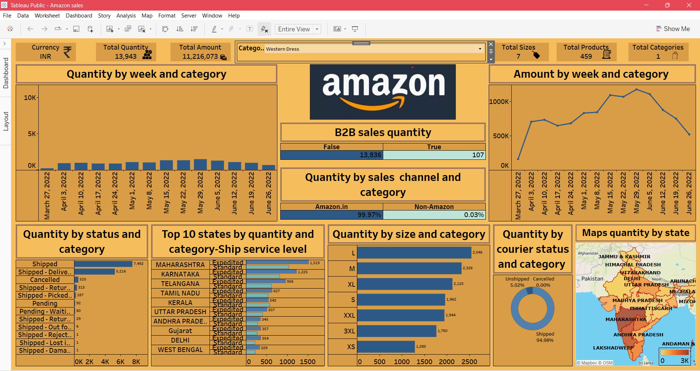

# Amazon Sales Analysis - Tableau Dashboard 📊

This Tableau dashboard analyzes Amazon B2B sales using weekly trends, top product categories, state-wise sales, and delivery status.

## 📁 Files Included
- `AmazonDashboard.twbx`: Tableau workbook containing the dashboard
- `dashboard-screenshot.png`: Image preview of the dashboard

## 📊 Key Insights
- Weekly trends in sales quantity and amount
- Quantity by shipping status, size, and delivery speed
- Sales across Indian states (map)
- Category-level and courier-level breakdown

## 🛠 Tools Used
- Tableau Public
- Excel (for data source)

## 📷 Dashboard Preview

